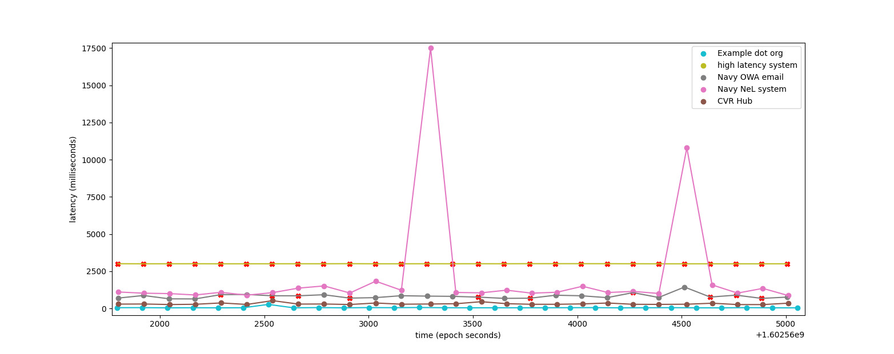

# Sys-Stat

`sys-stat.exe` reads a configuration file
describing services which the local machine is expected to
have access to. It defaults to the file `sys-stat.toml` in
the current working directory; if nonexistent it tries
to find a file named `.sys-stat.toml` in your home directory.
(commonly `C:\\Users\\User Name\\` on windows and '/home/user-name/' on \*nix systems.)

# Data Visualization

Run `python chart.py [/path/to/log.csv]` to display
a matplotlib chart of tested systems, like this:



The X axis is time in Epoch seconds, the Y axis is latency in milliseconds,
and an `X` on the line represents a point when the system was determined to
be down (either due to a closed connection, a timeout, or a response not having required content).

# Configuration file

see `sys-stat.toml` for an example config file.

The `[general]` section holds actions taken when
systems are offline and lets you set the log_file
where system statistics are written.

Each `[[sys]]` section describes a system which
will be tested periodically. At the moment only
`http://` and `https://` URLs are supported but the
long-term plan is to support many other protocols (`mysql://`, 'ftp://', etc.)

## Example Config

```toml

# Example config file

[general]
log_file = "/tmp/status.csv"

[[sys]]
name = "Example dot org"
uri = "http://example.org/"
description = """
  This system responds to http GET requests with a 200 and a document
  containing the phrase "This domain is for use in illustrative examples in documents".
"""
# If the response does not contain this the status becomes "bad"
response_must_contain = "This domain is for use in illustrative examples in documents"
# If the server does not finish replying within this amount of time the status becomes "bad"
response_must_finish_within = "30s"

check_interval = "5m"


[[sys]]
name = "high latency system"
uri = "http://slowwly.robertomurray.co.uk/delay/8000/url/http://example.org"
response_must_finish_within = "3s"
check_interval = "30s"

```


